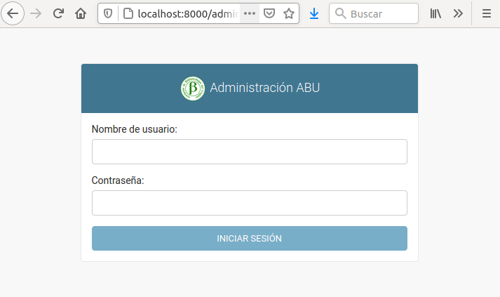

# Proyecto Final Tecnologo

Para la instalación se tomará como SO de base Ubuntu 18.04, pero si se utilizara el SO Windows no cambia sustancialmente esta guía.\
Debe tener instalado Python en su versión 3.6.5 y Git en su versión más reciente.

* Para comprobar la versión de Python y git:

```bash
python3 --version
Python 3.6.5

git --version
git version 2.7.4
```

* Dentro de la carpeta que elija, clonar el proyecto con Git:

```bash
 git clone <https://github.com/ernestomello/proyectoABU.git>
```

* Dentro de la carpeta proyectoABU ejecutar los siguientes comandos para crear el entorno virtual y para activarlo:

```bash
~/proyectoABU$ python3 -m venv venv
~/proyectoABU$ source /venv/bin/activate
```

* Una vez activado el entorno en el prompt se mostrará al inicio (venv)

```bash
(venv) :~/proyectoABU$
```

* Para instalar las librerías de Django, con el entorno activado, ejecutar:

```bash
(venv) :~/proyectoABU$ pip install -r requirements.txt
```

* Una vez completados los pasos anteriores para ejecutar el proyecto:

```bash
(venv) :~/proyectoABU$ cd gestionAbu
(venv) :~/proyectoABU/gestionAbu$ python3 manage.py runserver
```

* Si luego de ejecutado el comando anterior la consola muestra:

```text
Watching for file changes with StatReloader
Performing system checks...

System check identified no issues (0 silenced).
October 10, 2022 - 11:44:57
Django version 3.2.15, using settings 'gestionAbu.settings'
Starting development server at <http://127.0.0.1:8000/>
Quit the server with CONTROL-C.
```

* Abrir un navegador e ingrese la dirección <http://127.0.0.1:8000/> y mostrará la pantalla siguiente:


